# Petrol Log – Technical Architecture

> **Last updated:** 2026-02-21
> **Version:** 1.0.0+3
> **Stack:** Flutter (Dart 3.0+) · Provider · SharedPreferences

---

## Table of Contents

1. [System Overview](#1-system-overview)
2. [C4 Level 1 – System Context](#2-c4-level-1--system-context)
3. [C4 Level 2 – Container Diagram](#3-c4-level-2--container-diagram)
4. [C4 Level 3 – Component Diagram](#4-c4-level-3--component-diagram)
5. [Data Models](#5-data-models)
6. [State & Data Flow](#6-state--data-flow)
7. [Screen Navigation Map](#7-screen-navigation-map)
8. [Persistence Layer](#8-persistence-layer)
9. [Analytics & Forecasting](#9-analytics--forecasting)
10. [Platform Support & Build Matrix](#10-platform-support--build-matrix)
11. [Dependency Inventory](#11-dependency-inventory)
12. [Testing Strategy](#12-testing-strategy)
13. [Directory Reference](#13-directory-reference)

---

## 1. System Overview

Petrol Log is a **fully offline, single-user mobile/desktop application** built with Flutter. It stores all data locally on the device using SharedPreferences. There are no backend services, no external APIs, and no network calls at runtime.

Core responsibilities:
- Record and persist fuel fill events per vehicle
- Calculate mileage, cost trends, and efficiency metrics
- Predict the next refill date using a weighted-average forecasting model
- Track vehicle maintenance schedules with due-date alerting
- Support multi-vehicle and multi-fuel-type configurations

---

## 2. C4 Level 1 – System Context

Shows the system and its relationships with users and external elements.

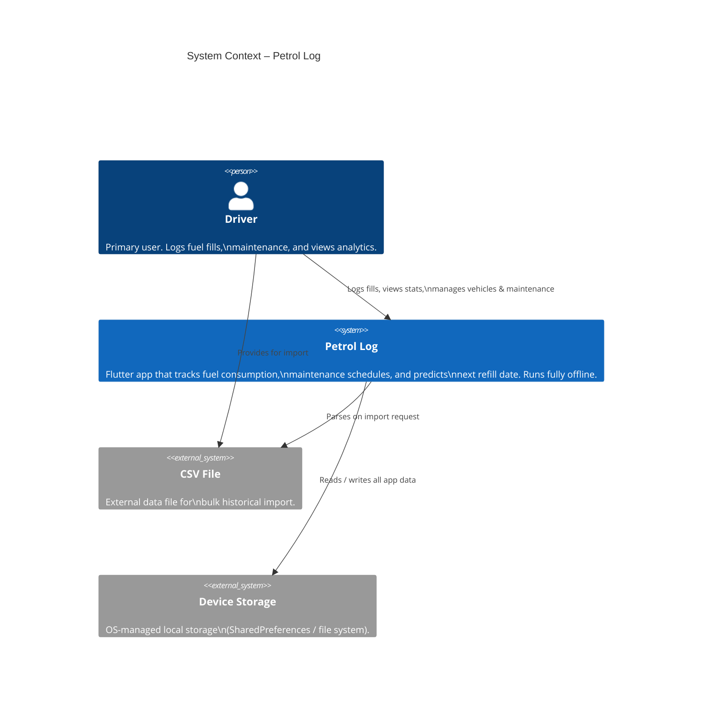

> **Key point:** Petrol Log has no network dependency at runtime. All data lives on-device.

---

## 3. C4 Level 2 – Container Diagram

Shows the major runtime containers (Flutter layers) inside the application.

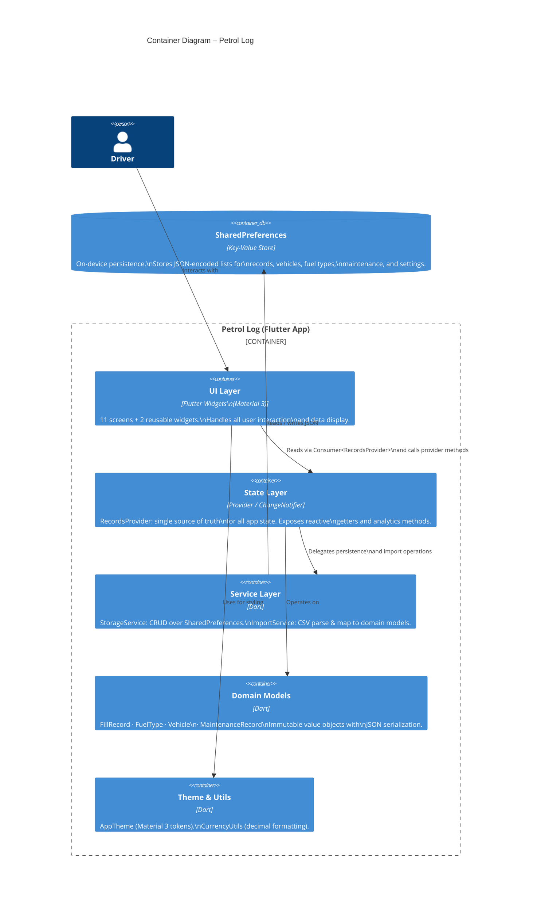

---

## 4. C4 Level 3 – Component Diagram

Drills into the three main containers: State Layer, Service Layer, and UI Layer.

### 4a. State Layer – RecordsProvider

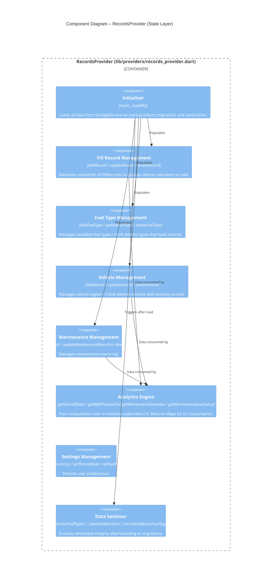

### 4b. Service Layer

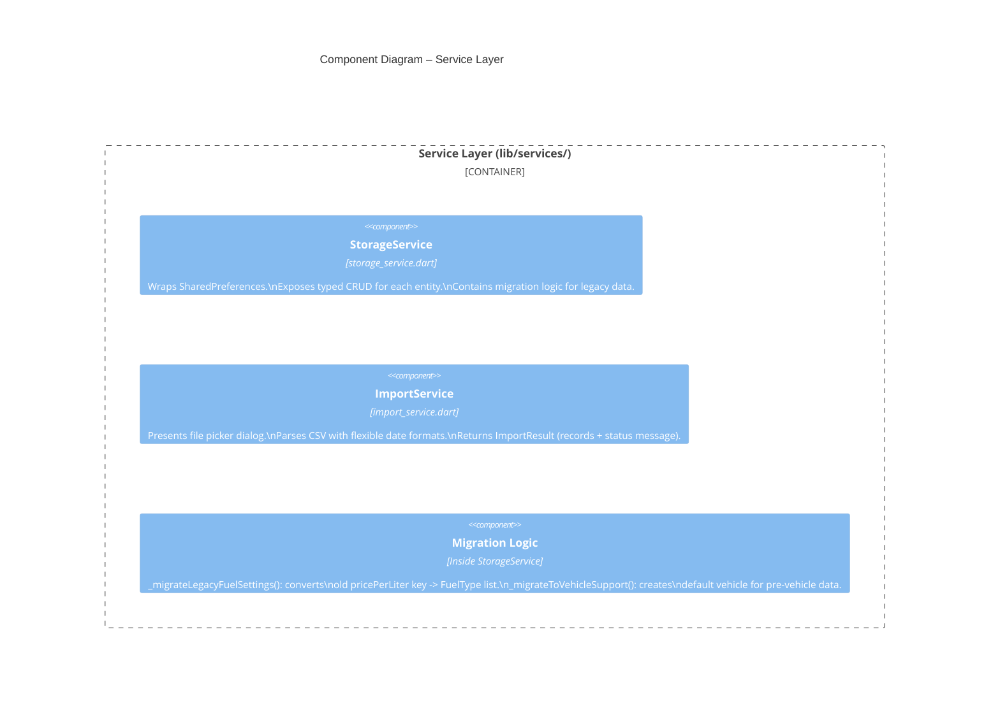

### 4c. UI Layer – Screen Inventory

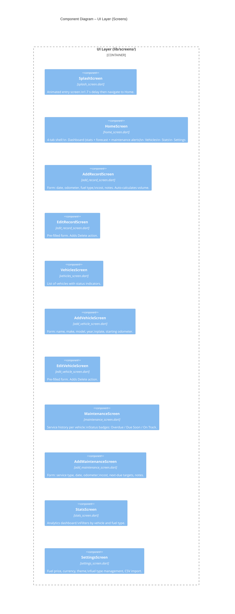

---

## 5. Data Models

All models are **immutable value objects** with `copyWith()`, `toJson()`, `fromJson()`, and equality by ID.

### Entity Relationship Diagram

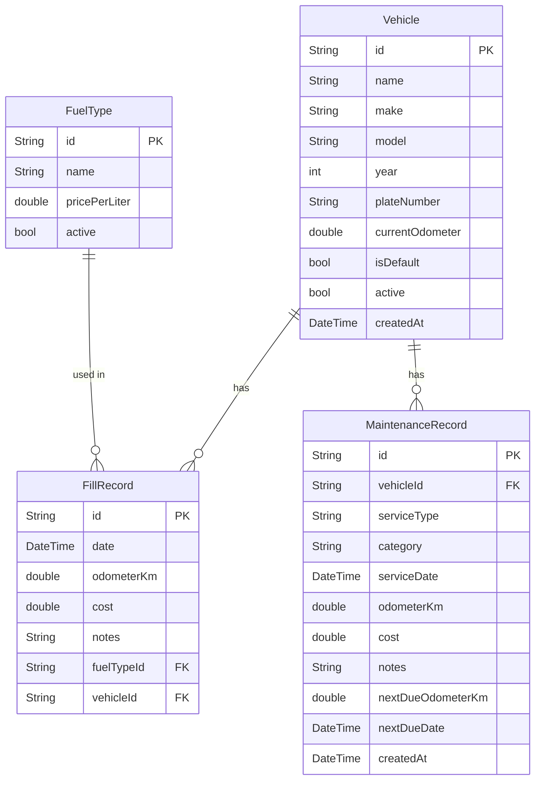

### Model Field Summary

| Model | Key Computed Properties |
|---|---|
| `FillRecord` | `getDistanceSinceLastFill()`, `getFuelAddedLiters()`, `getMileage()`, `getDaysSinceLastFill()` |
| `FuelType` | `normalizeId()` – sanitizes raw name to a stable key |
| `Vehicle` | `currentOdometer` updated by provider on each fill add |
| `MaintenanceRecord` | `hasDueTarget`, `normalizedServiceType`, `scheduleKey` |

### SharedPreferences Storage Keys

| Key | Type | Description |
|---|---|---|
| `fill_records` | JSON array | All `FillRecord` objects |
| `fuel_types` | JSON array | All `FuelType` objects |
| `selected_fuel_type_id` | String | Currently active fuel type |
| `vehicles` | JSON array | All `Vehicle` objects |
| `selected_vehicle_id` | String | Currently selected vehicle |
| `maintenance_records` | JSON array | All `MaintenanceRecord` objects |
| `currency_symbol` | String | Currency symbol (default: `₹`) |
| `theme_mode` | String | `light` / `dark` / `system` |
| `fuel_price_per_liter` | double | Legacy key (migrated to FuelType) |

---

## 6. State & Data Flow

### Reactive Update Cycle

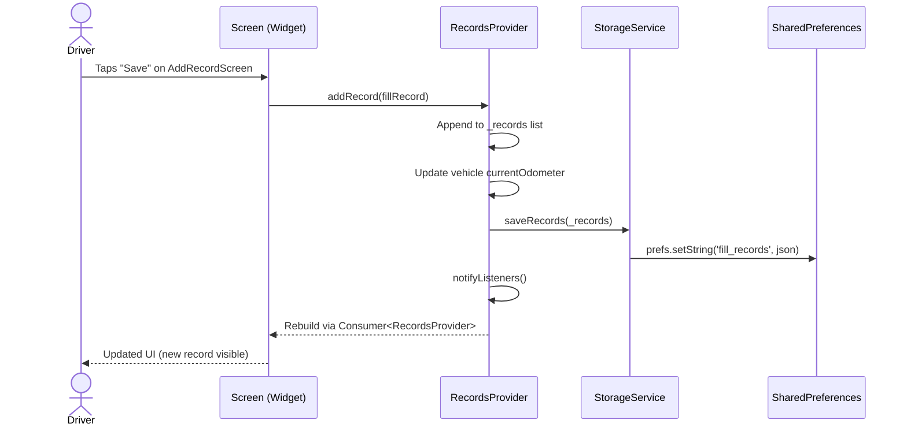

### App Startup Sequence

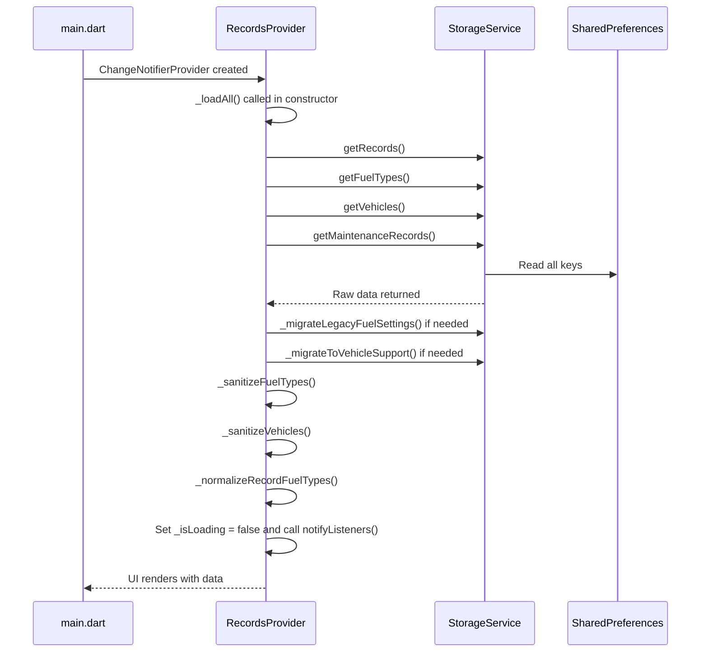

### Multi-Dimensional Filtering

Records can be filtered simultaneously by vehicle and fuel type. The helper `_filteredRecordsByFuelTypeAndVehicle()` applies both filters and is used by all analytics methods.

```
null / 'all'  → no filter applied on that dimension
specific ID   → filter to matching records only
```

---

## 7. Screen Navigation Map

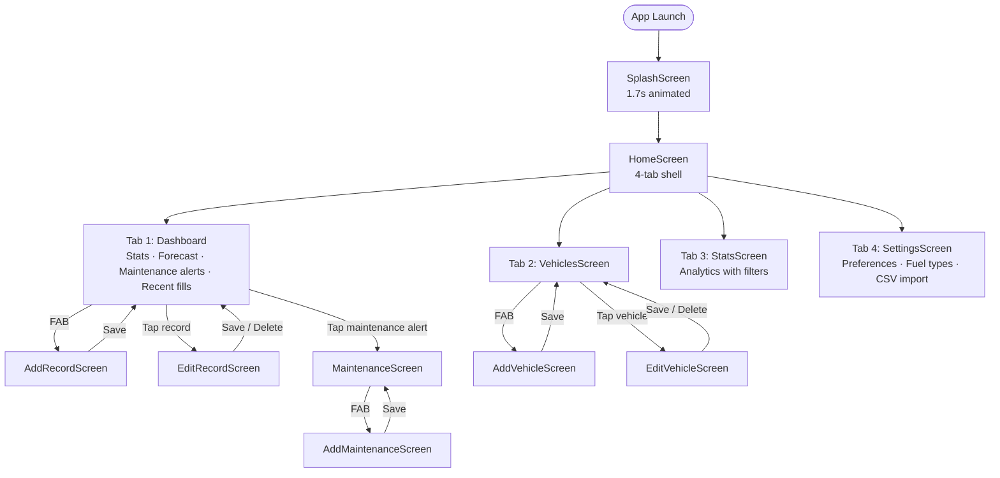

---

## 8. Persistence Layer

### StorageService Architecture

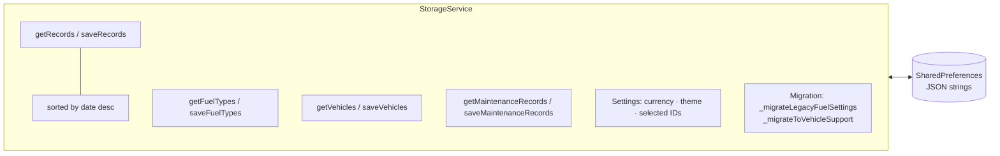

### Migration Strategy

| Migration | Trigger | Action |
|---|---|---|
| `_migrateLegacyFuelSettings` | `fuel_price_per_liter` key exists on load | Creates a `Regular` FuelType using the stored price; removes old key |
| `_migrateToVehicleSupport` | `vehicles` key empty but `fill_records` exist | Creates a `My Vehicle` default vehicle; sets `vehicleId` on all existing records |

---

## 9. Analytics & Forecasting

### Overall Stats (`getOverallStats`)

Aggregates across filtered records:

| Output | Calculation |
|---|---|
| `totalSpent` | Sum of all `FillRecord.cost` |
| `totalFuelLiters` | Sum of `cost / pricePerLiter` per record |
| `totalDistance` | Sum of `getDistanceSinceLastFill()` across consecutive pairs |
| `averageMileage` | `totalDistance / totalFuelLiters` |
| `bestMileage` / `worstMileage` | Max/min per-record mileage with associated record |
| `monthlySpending` | `Map<"YYYY-MM", double>` keyed by fill month |

### Refill Forecast (`getRefillForecast`)

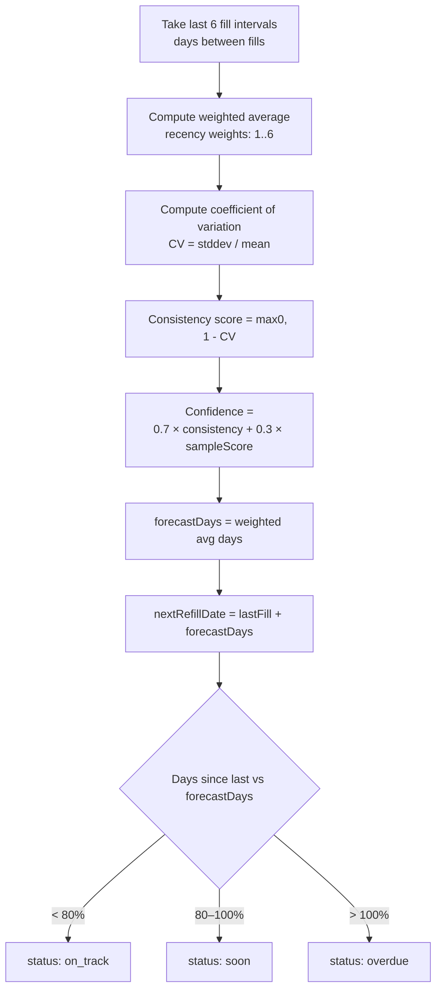

**Confidence range:** 0.20 – 0.95
**Minimum records needed:** 2 (for at least one interval)

### Maintenance Due Status (`getMaintenanceDueStatus`)

Evaluated independently by odometer and date. The more urgent dimension wins.

| Condition | Status |
|---|---|
| Past due odometer **or** past due date | `overdue` |
| Within 500 km **or** within 14 days | `due_soon` |
| No due target set | `on_track` |
| Has target and not near | `on_track` |

---

## 10. Platform Support & Build Matrix

| Platform | Status | Build Command |
|---|---|---|
| Android | Supported | `flutter build apk --release` |
| iOS | Supported (pending bundle ID) | `flutter build ipa --release --no-codesign` |
| macOS | Supported | `flutter build macos --release` |
| Web | Supported | `flutter build web --release` |

All platforms share the same Dart codebase. Platform-specific folders (`android/`, `ios/`, `macos/`, `web/`) contain only native configuration.

---

## 11. Dependency Inventory

| Package | Version | Purpose |
|---|---|---|
| `provider` | ^6.1.1 | Reactive state management (ChangeNotifier) |
| `shared_preferences` | ^2.2.2 | On-device key-value persistence |
| `google_fonts` | ^6.1.0 | Space Grotesk typography |
| `intl` | ^0.19.0 | Date/number formatting, localization |
| `csv` | ^6.0.0 | CSV parsing for historical import |
| `file_picker` | ^10.3.10 | Cross-platform file selection dialog |
| `cupertino_icons` | ^1.0.6 | iOS-style icon set |
| `flutter_lints` | ^3.0.1 | Dev: lint rules |
| `mocktail` | ^1.0.4 | Dev: test mocking |

No network packages. No analytics SDKs. No crash reporting SDKs.

---

## 12. Testing Strategy

### Test Coverage Map

| Layer | Test File | Key Scenarios |
|---|---|---|
| `FillRecord` model | `test/models/fill_record_test.dart` | Distance, mileage, volume, days calculations |
| `FuelType` model | `test/models/fuel_type_test.dart` | ID normalization, serialization |
| `Vehicle` model | `test/models/vehicle_test.dart` | Equality, serialization |
| `MaintenanceRecord` | `test/models/maintenance_record_test.dart` | Due status, scheduleKey |
| `RecordsProvider` | `test/providers/records_provider_test.dart` | Analytics, filtering, CRUD |
| `ImportService` | `test/services/import_service_test.dart` | Date format variants, edge cases |
| `CurrencyUtils` | `test/utils/currency_utils_test.dart` | Decimal places, formatting |

### Running Tests

```bash
flutter test              # all tests
flutter test --coverage   # with coverage report
flutter analyze           # static analysis
dart format lib test      # format before commit
```

---

## 13. Directory Reference

```
petrol_log/
├── lib/
│   ├── main.dart                        # App entry: ChangeNotifierProvider + MaterialApp
│   ├── models/
│   │   ├── fill_record.dart             # Fuel fill event
│   │   ├── fuel_type.dart               # Fuel type with price
│   │   ├── vehicle.dart                 # Vehicle entity
│   │   └── maintenance_record.dart      # Service/maintenance event
│   ├── providers/
│   │   └── records_provider.dart        # Central state (1075 lines)
│   ├── services/
│   │   ├── storage_service.dart         # SharedPreferences CRUD + migrations
│   │   └── import_service.dart          # CSV import with file picker
│   ├── screens/
│   │   ├── splash_screen.dart
│   │   ├── home_screen.dart             # 4-tab shell
│   │   ├── add_record_screen.dart
│   │   ├── edit_record_screen.dart
│   │   ├── add_vehicle_screen.dart
│   │   ├── edit_vehicle_screen.dart
│   │   ├── vehicles_screen.dart
│   │   ├── maintenance_screen.dart
│   │   ├── add_maintenance_screen.dart
│   │   ├── stats_screen.dart
│   │   └── settings_screen.dart
│   ├── widgets/
│   │   ├── record_card.dart             # Fill record display card
│   │   └── glass_panel.dart             # Glassmorphism container
│   ├── theme/
│   │   └── app_theme.dart               # Material 3 light/dark themes
│   └── utils/
│       └── currency_utils.dart          # Currency decimal handling
├── test/                                # Mirrors lib/ structure
│   ├── models/
│   ├── providers/
│   ├── services/
│   └── utils/
├── assets/                             # App icons and branding
├── tools/
│   └── generate_app_store_assets.py    # App Store screenshot generator
├── output/app_store/                   # Generated store assets
├── android/ ios/ macos/ web/           # Platform-specific native config
├── docs/
│   └── ARCHITECTURE.md                 # This file
├── pubspec.yaml
├── analysis_options.yaml
├── AGENTS.md                           # Repo guidelines for AI agents
├── CLAUDE.md                           # Cost-optimization guidelines
└── README.md                           # Product overview
```

---

## Changelog

| Date | Version | Change |
|---|---|---|
| 2026-02-21 | 1.0.0+3 | Fixed Mermaid syntax in “App Startup Sequence” by replacing a semicolon-delimited action label with parser-safe wording. |
| 2026-02-21 | 1.0.0+3 | Fixed Mermaid C4 syntax in §4b and §4c by converting multiline `Component(...)` declarations to single-line statements and normalizing special symbols for parser compatibility. |
| 2026-02-21 | 1.0.0+3 | Fixed Mermaid C4 container/component syntax by putting `Container(...)`, `ContainerDb(...)`, and `Component(...)` definitions on single lines for parser compatibility. |
| 2026-02-21 | 1.0.0+3 | Initial architecture document created. Covers C4 L1–L3, ERD, data flow, navigation, persistence, analytics, platform matrix. |
